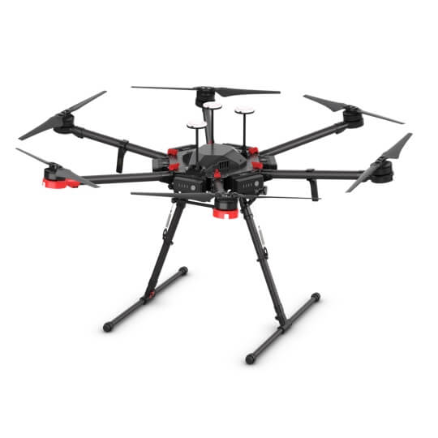
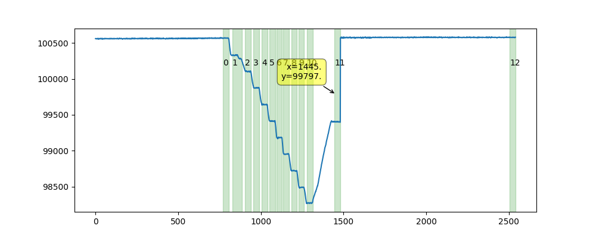

# Vertical Profile Analysis Tool For Atmospheric Properties Measured By UAV “Stairs” Method

## Background
Our laboratory researches the chemical and physical properties of various aerosols and their impact on atmospheric processes, climate, and human health. We use advanced techniques to monitor aerosols in the atmosphere, including an emerging in-situ aerosol detection method using UAVs (Unmanned Aerial Vehicles) equipped with sensitive sensors to detect vertical profiles. The monitoring process involves a "stairs" protocol where the UAV ascends to a specific height, hovers for a few seconds, then ascends to the next height, repeating the process. During this time, atmospheric properties are continuously measured by the sensors with a focus on the mean hovering periods data (steps) rather than the ascent periods data.

<p align="center">
  
  
</p>

## Project Goal
The goal of this project is to develop a semi-automated system to extract and analyze the relevant measured data. Due to the inaccuracy of existing altimeters, the pressure variable is used as an altitude indicator. The system will process the measurement results in the CSV files, construct a pressure profile graph, and identify the straight portions representing the hovering "steps". The system will provide timestamp recommendations for the start and end of each step. Users will be able to select relevant steps, remove unwanted portions from the data, and create a clean correlation graph between pressure and chosen measured variables.


## User Instructions
1. **Browse and Select CSV File:** Use the GUI to browse and select the CSV file containing your measurement data.
2. **Specify Parameters:**
   - **Index Column:** Input the column name representing the timestamps.
   - **Steps Analysis Column:** Input the column name representing the pressure or altitude data.
   - **Measured Stats Column:** Input the column name for the atmospheric composition parameters to be analyzed.
   - **Steps Size:** Define the duration for each step in seconds.
   - **Variance Threshold:** Set the variance threshold for detecting stable intervals (depends on measurment units).
3. **Plot Suggested Intervals:** Click the "Select Intervals" button. The program will plot the steps data with suggested intervals based on the specified parameters.
4. **Subtract Intervals:** In the plot, select unwanted intervals by clicking on them. After exiting the plot, confirm if you want to subtract the selected intervals from the data.
5. **Plot Statistics:** After subtracting the selected intervals, confirm if you want to plot the measurement statistics for the remaining intervals.
6. **Save Intervals:** After exiting the statistics plot, you can choose to save the selected intervals as a JSON file.

# Usage Example (for 'example_CSV' in 'Data' file):
Index Column: timestamp
Steps Analysis Column: hum_pressure
Measured Stats Column: pom_ozone
Steps Size: 35
Variance Threshold: 70


## Input
CSV file containing the following columns:
- Timestamp
- Pressure
- Measurable atmospheric composition parameters


### Installing the dependencies:
To install the required packages listed in requirements.txt, run the following command:
```
pip install -r requirements.txt
```

### Testing the program:
To test the program, run:
```
pytest
```

### Running the program:
To run the program, execute:
```
python UAV_steps_analysis.py
```

This project was originally implemented as part of the [Python programming course](https://github.com/szabgab/wis-python-course-2024-04) at the [Weizmann Institute of Science](https://www.weizmann.ac.il/) taught by [Gabor Szabo](https://szabgab.com/).


